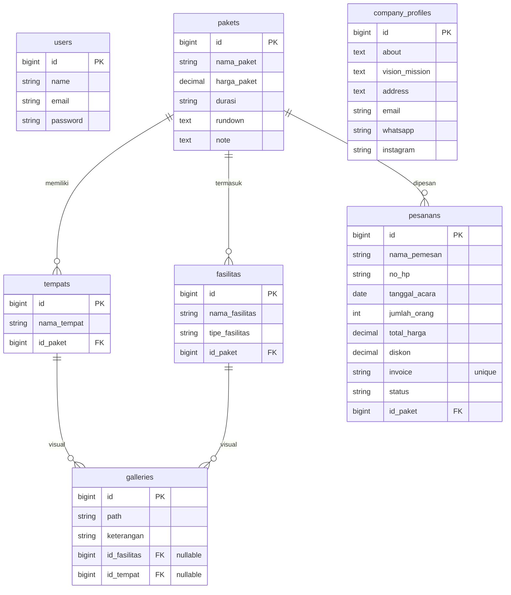

# Product Requirements Document (PRD)

## Sistem Manajemen Ghina Tour Travel

---

## 1. Gambaran Umum (Overview)

**Sistem Manajemen Ghina Tour Travel** adalah aplikasi berbasis web yang dirancang untuk merampingkan operasional agen perjalanan. Sistem ini menyediakan portal khusus pelanggan di mana pengguna dapat menjelajahi paket wisata, melihat _itinerary_ (jadwal perjalanan), dan berinteraksi dengan asisten virtual (Chatbot) untuk mendapatkan informasi secara cepat. Untuk sisi bisnis, sistem ini menawarkan _Admin Dashboard_ yang aman untuk mengelola paket wisata, melacak pesanan pelanggan, memperbarui profil perusahaan, dan mengelola galeri visual.

## 2. Persyaratan Sistem (Requirements)

- **Aksesibilitas Web:** Sistem harus dapat diakses melalui browser web modern dan responsif pada perangkat desktop maupun seluler (mobile).
- **Performa:** Waktu pemuatan (loading) yang cepat untuk halaman pelanggan guna memastikan kenyamanan dan retensi pengguna yang tinggi.
- **Keamanan:** Dashboard Admin harus dilindungi oleh sistem otentikasi (login). Data pelanggan yang sensitif (seperti nomor telepon, invoice pesanan) harus ditangani secara aman.
- **Otomatisasi:** Sistem harus mengotomatiskan penyaringan (filtering) pesanan dan memberikan respons instan berbasis aturan (_rule-based_) melalui Chatbot tanpa memerlukan API AI pihak ketiga.
- **Skalabilitas:** Arsitektur database harus mampu menangani data relasional secara efisien (seperti Paket, Fasilitas, Tempat Tujuan, Galeri, dan Pesanan).

## 3. Fitur Utama (Core Features)

### 3.1. Portal Pelanggan

- **Eksplorasi Paket:** Pelanggan dapat melihat paket tour yang tersedia, termasuk harga, durasi, jadwal kegiatan (_rundown_), dan fasilitas yang termasuk di dalamnya.
- **Informasi Perusahaan:** Akses ke sejarah perusahaan, visi, misi, dan detail kontak.
- **Asisten Virtual (Chatbot):** _Widget floating_ (mengambang) yang memungkinkan pelanggan mencari detail paket, memeriksa status pesanan (menggunakan nomor telepon atau ID invoice), dan melihat info perusahaan melalui menu panduan atau input kata kunci (_keyword_).

### 3.2. Admin Dashboard

- **Manajemen Pesanan (Order Management):**
- Melihat, mengedit, dan menghapus pesanan pelanggan.
- Penyaringan tingkat lanjut dengan fungsi otomatis submit (_auto-submit_) (Pencarian berdasarkan nama/invoice, Filter berdasarkan Status, Filter berdasarkan Tanggal).

- **Manajemen Paket (Package Management):**
- Membuat dan mengelola paket tour (`Paket`).
- Mengelola tempat tujuan (`Tempat`) dan fasilitas (`Fasilitas`) yang terhubung dengan masing-masing paket.

- **Manajemen Galeri:** Mengunggah dan mengelola gambar promosi yang ditautkan ke fasilitas atau tempat tujuan tertentu.
- **Manajemen Profil Perusahaan:** Memperbarui informasi bisnis, tautan media sosial, dan detail kontak yang ditampilkan kepada pelanggan.

---

## 4. Alur Pengguna (User Flow)

### 4.1. Alur Pelanggan (Customer Flow)

1. **Halaman Utama (Landing):** Pelanggan mengunjungi beranda website.
2. **Eksplorasi:** Menjelajahi paket tour yang tersedia dan melihat detailnya (harga, _rundown_, fasilitas).
3. **Bantuan Cepat:** Mengklik widget Chatbot untuk bantuan instan. Mengetik "menu" atau kata kunci spesifik (misal: "info paket"). Chatbot akan mengambil data _real-time_ dari database dan memberikan balasan.
4. **Pelacakan Pesanan:** Pelanggan mengetikkan nomor telepon mereka ke dalam Chatbot untuk mengecek status pesanan yang telah mereka buat.

### 4.2. Alur Admin (Admin Flow)

1. **Otentikasi:** Admin masuk (login) ke dashboard yang aman.
2. **Pemrosesan Pesanan:** Navigasi ke halaman "Pesanan". Menggunakan _Search Bar_ atau _Dropdown Status_ (yang melakukan submit otomatis) untuk menemukan pesanan yang berstatus _pending_ (menunggu) dengan cepat.
3. **Pembaruan Konten:** Navigasi ke halaman "Paket" atau "Company Profile" untuk memperbarui harga, menambah tujuan tour baru, atau memperbarui info kontak.
4. **Kueri Cepat:** Admin juga dapat menggunakan widget Chatbot yang terintegrasi di dashboard untuk mengambil invoice pesanan atau detail paket tertentu secara cepat tanpa harus berpindah-pindah menu.

---

## 5. Skema Database (Database Schema)

Berikut adalah visualisasi hubungan antar tabel menggunakan Mermaid ER Diagram:

> **Catatan Relasi:**
>
> - Satu **Paket** bisa memiliki banyak **Tempat**, **Fasilitas**, dan **Pesanan**.
> - **Galeri** bersifat opsional dan bisa merujuk ke **Tempat** wisata atau **Fasilitas** tertentu.

---

## 6. User Role & Permission (Peran & Hak Akses)

### 6.1. Admin (`admin`)

Admin memiliki kontrol penuh atas sistem manajemen tour travel.

- **Hak Akses:** Dashboard analitik, manajemen pesanan (CRUD), manajemen paket (CRUD), manajemen galeri, dan profil perusahaan.

### 6.2. Pelanggan (`customer`)

Pelanggan adalah pengguna akhir yang berinteraksi dengan website.

- **Hak Akses:** Eksplorasi paket, membuat pemesanan, mengelola profil pribadi, dan menggunakan Chatbot pelacakan.
