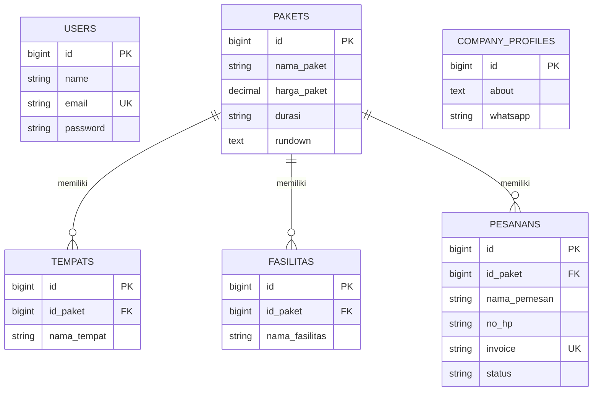

# PRODUCT REQUIREMENT DOCUMENT (PRD)

## Sistem Manajemen Ghina Tour & Travel

---

## 1. PRODUCT OVERVIEW

**Website Ghina Tour & Travel** adalah aplikasi berbasis web yang dirancang untuk merampingkan operasional agen perjalanan sekaligus menjadi media promosi digital. Sistem ini menyediakan portal khusus pelanggan untuk mengeksplorasi paket wisata dan berinteraksi dengan asisten virtual cerdas berbasis **Google Gemini AI**. Bagi pengelola, sistem ini menawarkan _Admin Dashboard_ yang aman untuk mengelola paket, pesanan, profil perusahaan, dan galeri visual secara terpusat.

---

## 2. PRODUCT GOALS

### 2.1 Tujuan Utama

- Meningkatkan efektivitas promosi paket wisata secara digital melalui asisten AI.
- Mempermudah calon pelanggan dalam memperoleh informasi dan melacak pesanan.
- Meningkatkan efisiensi operasional pengelolaan data melalui otomatisasi internal.

---

## 3. TARGET USERS & NEEDS

| User         | Deskripsi                                      | Kebutuhan Utama                                                  |
| :----------- | :--------------------------------------------- | :--------------------------------------------------------------- |
| **Customer** | Individu, keluarga, atau instansi (wisatawan). | Akses info cepat via AI, cek status pesanan, booking via WA.     |
| **Admin**    | Staff operasional Ghina Tour & Travel.         | Kelola paket, pantau statistik, validasi pesanan, update konten. |

---

## 4. SYSTEM & NON-FUNCTIONAL REQUIREMENTS

- **Aksesibilitas:** Responsif pada perangkat desktop maupun seluler (_Mobile Friendly_).
- **Performa:** Waktu pemuatan (_loading_) maksimal **3 detik**.
- **Keamanan:** Proteksi _Login Authentication_ admin dan penanganan data sensitif.
- **Integrasi AI:** Koneksi stabil ke API Google Gemini dengan penanganan kuota/limit yang tepat.
- **Tema:** Fitur _Dark/Light Mode_ dengan penyimpanan preferensi user.

---

## 5. CORE FEATURES

### 5.1 Halaman Pelanggan (Customer Side)

- **Landing Page:** Hero section, _About Us_, daftar paket unggulan, galeri dokumentasi, dan footer informasi.
- **Eksplorasi Paket:** Detail mendalam mengenai destinasi, harga, durasi, fasilitas, dan _rundown_ kegiatan.
- **Gemini AI Chatbot (Virtual Assistant):**
    - Menggunakan model **Gemini 1.5 Flash/Pro** untuk menjawab pertanyaan secara luwes.
    - Mampu memahami konteks paket wisata yang tersedia.
    - Pelacakan status pesanan melalui integrasi data database internal.
- **WhatsApp Integration:** Tombol _redirect_ dengan template pesan otomatis untuk _booking_.

### 5.2 Admin Dashboard (Admin Side)

- **Dashboard Statistik:** Visualisasi total paket, total pesanan, grafik pendapatan, dan pesanan terbaru.
- **Manajemen Paket:** CRUD paket wisata (Fasilitas(terdapat 3 kategori yaitu akomodasi, transportasi, konsumsi), Tempat, Rundown).
- **Manajemen Pesanan:** Filter _auto-submit_, perhitungan diskon, dan pembuatan invoice.
- **Manajemen Galeri:** CRUD media yang ditautkan ke konten tertentu.
- **Profil Perusahaan:** Update informasi bisnis dan kontak.

---

## 6. USER FLOW

1.  **Pelanggan** mengunjungi web ➔ bertanya ke **Gemini Chatbot** tentang paket murah ➔ AI memberikan saran berdasarkan data _real-time_ ➔ Pelanggan klik WhatsApp untuk booking.
2.  **Admin** login ➔ menambah paket baru ➔ AI secara otomatis "mengetahui" paket baru tersebut (melalui penyuntikan konteks data) dan dapat menawarkannya ke pelanggan.

---

## 7. DATABASE SCHEMA (ERD)

---

## 8. Chatbot AI & LLM INTEGRATION (GOOGLE GEMINI)

- **Model:** Menggunakan `Gemini 1.5 Flash` (untuk kecepatan) atau `Gemini 1.5 Pro` (untuk penalaran mendalam).
- **Context Injection (RAG):** Sistem akan mengirimkan data paket wisata dan info perusahaan sebagai _System Instruction_ atau _Context_ ke API Gemini agar AI memberikan jawaban yang akurat sesuai data perusahaan (bukan halusinasi).
- **Function Calling:** AI dapat diprogram untuk memanggil fungsi khusus guna mengecek status pesanan di database berdasarkan nomor HP yang diberikan user.
- **Multimodal:** AI berpotensi menganalisis gambar galeri jika pelanggan bertanya tentang foto tertentu.
- **Tone of Voice:** AI diatur untuk berbicara dengan gaya ramah, informatif, dan persuasif seperti agen travel profesional.

---

## 9. SUCCESS METRICS

- **AI Accuracy:** Tingkat kesesuaian jawaban AI dengan data paket asli.
- **User Satisfaction:** Berkurangnya pertanyaan berulang ke WhatsApp karena sudah terjawab oleh AI.
- **Conversion Rate:** Jumlah user yang lanjut ke WhatsApp setelah berinteraksi dengan Gemini.

---

## 10. CONSTRAINTS & FUTURE DEVELOPMENT

- **Constraints:** Bergantung pada konektivitas API Google dan batas kuota (rate limit) API.
- **Future Dev:** Integrasi _voice-to-text_ agar pelanggan bisa bertanya melalui suara, serta otomatisasi pembuatan _itinerary_ kustom oleh AI untuk grup besar.

---

**END OF DOCUMENT**
